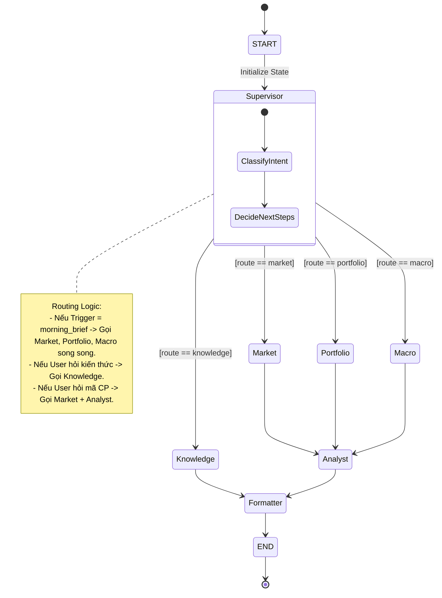
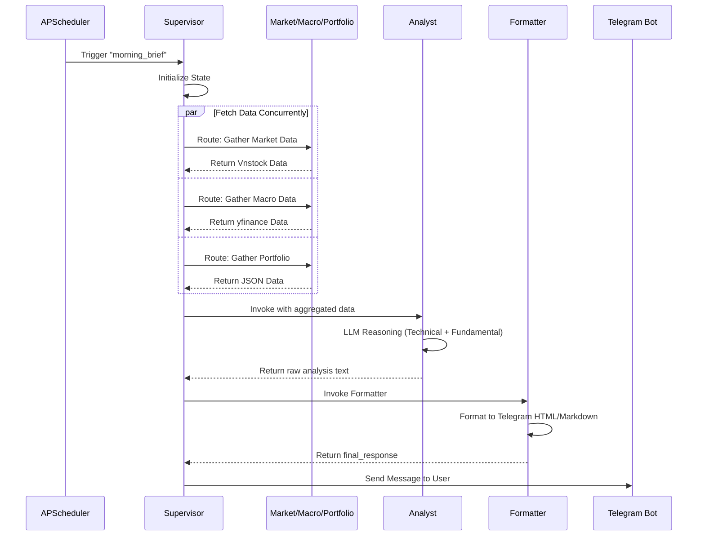
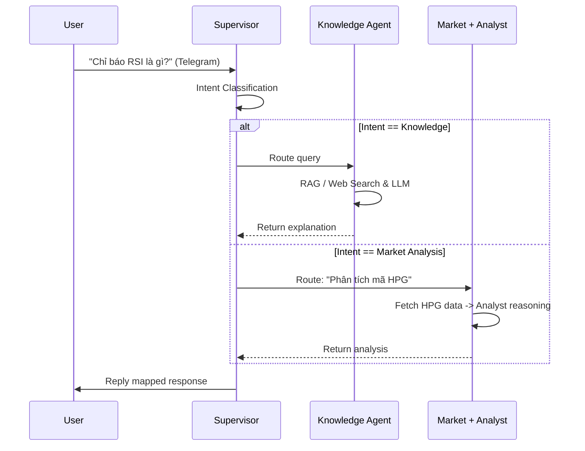

# Trading Mentor Agent - System Architecture & Implementation Plan

Tài liệu này mô tả chi tiết các bản vẽ kiến trúc hệ thống, luồng dữ liệu (Data Flow) và thiết kế StateGraph (LangGraph) cho dự án Trading Mentor Agent, cùng với lộ trình triển khai chi tiết.

## 1. Kiến Trúc Tổng Thể Hệ Thống (High-Level Architecture)

Biểu đồ dưới đây thể hiện các thành phần chính của hệ thống và cách chúng giao tiếp với nhau.

```mermaid
flowchart TD
    %% External Interfaces
    subgraph Interfaces [User Interfaces & Triggers]
        TG[Telegram Bot API]
        Cron[APScheduler / Cron Jobs]
    end

    %% Orchestrator
    subgraph Core [Core Orchestration - LangGraph]
        Supervisor((Supervisor Agent))
    end

    %% Specialist Agents
    subgraph Specialists [Specialist Agents]
        Market[Market Agent\n(Vnstock)]
        Macro[Macro Agent\n(yfinance/API)]
        Port[Portfolio Agent\n(Local JSON)]
        Knowledge[Knowledge/Tutor Agent\n(LLM + Search)]
        Analyst[Analyst Agent\n(LLM Reasoning)]
        Formatter[Formatter Agent\n(Markdown Output)]
    end

    %% Data Sources
    subgraph Data [External Data Sources]
        Vnstock[(Vnstock API)]
        YF[(Yahoo Finance)]
        LocalDB[(Local JSON DB)]
        Web[(Web Search)]
    end

    %% Connections
    TG <-->|Chat Messages| Supervisor
    Cron -->|Scheduled Events| Supervisor
    
    Supervisor ==>|Route & Delegate| Market
    Supervisor ==>|Route & Delegate| Macro
    Supervisor ==>|Route & Delegate| Port
    Supervisor ==>|Route & Delegate| Knowledge

    Market -->|Fetch| Vnstock
    Macro -->|Fetch| YF
    Port <-->|Read/Write| LocalDB
    Knowledge -->|Search| Web

    Market -.->|Data| Analyst
    Macro -.->|Data| Analyst
    Port -.->|Data| Analyst
    
    Knowledge -.->|Output| Formatter
    Analyst -.->|Output| Formatter
    
    Formatter -.->|Send Reply| TG
```

---

## 2. Thiết kế LangGraph (StateGraph & Conditional Routing)

Đây là "trái tim" của hệ thống. Chúng ta sử dụng một `TypedDict` làm State chung để truyền qua lại giữa các Node.



### Cấu trúc State (TypedDict) đề xuất
```python
class AgentState(TypedDict):
    messages: Annotated[Sequence[BaseMessage], operator.add] # Lịch sử chat
    trigger_type: str        # 'chat', 'morning_brief', 'evening_review'
    user_intent: str         # 'market_query', 'knowledge_query', 'portfolio_query'
    market_data: dict        # Chứa dữ liệu OHLCV, volume từ Vnstock
    macro_data: dict         # Chứa dữ liệu tỷ giá, DOW JONES từ yfinance
    portfolio_data: dict     # Chứa danh mục hiện tại từ JSON
    analyst_output: str      # Kết quả phân tích từ Analyst
    final_response: str      # Kết quả đã format để gửi Telegram
```

---

## 3. Biểu đồ Tuần tự (Sequence Diagrams)

### Luồng 1: Scheduled Trigger (Morning Brief / Evening Review)

Luồng này là luồng Push (hệ thống chủ động đẩy tin nhắn). Tận dụng khả năng xử lý song song (Parallel execution) của LangGraph để fetch dữ liệu nhanh hơn.



### Luồng 2: Interactive Chat (Người dùng hỏi đáp)

Luồng này yêu cầu Supervisor phân tích Intent (mục đích) của câu hỏi để định tuyến (Route) cho phù hợp.



---

## 4. Lộ Trình Triển Khai (Phased Implementation Plan)

Dựa trên các bản thiết kế kiến trúc, chúng ta sẽ chia việc xây dựng thành 4 Phase như đã thống nhất:

### Phase 1: Nền tảng (Core Architecture & StateGraph)
- **Mục tiêu:** Xây dựng khung LangGraph cơ bản chạy được trên Terminal.
- **Công việc:**
  - Setup môi trường Python (Poetry/Pip), cài đặt `langgraph`, `langchain`, `vnstock`, `yfinance`.
  - Định nghĩa `AgentState` (TypedDict).
  - Viết logic cơ bản cho `Market Agent` (lấy dữ liệu cứng 1-2 mã chứng khoán bằng Vnstock).
  - Viết logic `Analyst Agent` (LLM prompt cơ bản để nhận xét dữ liệu).
  - Nối Graph: `START -> Supervisor -> Market -> Analyst -> END`.
- **Nghiệm thu:** Chạy file `main.py`, hệ thống in ra được nhận định cơ bản về mã cổ phiếu trên Terminal.

### Phase 2: Multi-Agent & Data Sources (Mở rộng các Agent)
- **Mục tiêu:** Thêm Macro Agent và Portfolio Agent, hoàn thiện luồng Morning Brief.
- **Công việc:**
  - Thêm `Macro Agent` sử dụng `yfinance` lấy tỷ giá USD/VND và DOW JONES.
  - Thêm `Portfolio Agent` đọc danh sách mã từ file `portfolio.json`.
  - Cập nhật LangGraph để chạy song song 3 Agent thu thập dữ liệu trước khi pass cho Analyst.
  - Thêm `Formatter Agent` để làm đẹp output.
- **Nghiệm thu:** Gọi luồng `morning_brief` trên Terminal trả về bản tin hoàn chỉnh bao gồm vĩ mô, thị trường chung và danh mục cá nhân.

### Phase 3: Bot Integration & Interactive Flow
- **Mục tiêu:** Tích hợp Telegram và luồng Chat tương tác.
- **Công việc:**
  - Dựng Telegram Bot API bằng `aiogram` hoặc `python-telegram-bot`.
  - Tích hợp `APScheduler` để tự động chạy morning_brief vào giờ định trước.
  - Thêm logic Intent Classification vào `Supervisor` để route câu hỏi từ Telegram chat.
  - Xây dựng `Knowledge Agent` cho các câu hỏi thuần học thuật.
- **Nghiệm thu:** Bot hoạt động trên Telegram, tự gửi tin nhắn buổi sáng và có thể trả lời khi người dùng chat.

### Phase 4: Nâng cao (Memory & Human-in-the-loop)
- **Mục tiêu:** Bot có trí nhớ và có thể quản lý danh mục qua chat.
- **Công việc:**
  - Tích hợp `MemorySaver` (SQLite checkpointer) của LangGraph để bot nhớ bối cảnh chat.
  - Thêm logic Human-in-the-loop để xác nhận trước khi ghi nhận giao dịch mua/bán vào file JSON portfolio.

---

## Ý kiến phản hồi (Open Questions)

> [!IMPORTANT]
> Đây là bản thiết kế hệ thống. Bạn vui lòng xem qua các sơ đồ (Architecture, StateGraph, Sequence Diagram) và Lộ trình triển khai (4 phases).
> - Cấu trúc StateDict và các Luồng như vậy đã đúng với kỳ vọng của bạn chưa?
> - Nếu bạn đồng ý, chúng ta sẽ bắt tay vào viết code cho **Phase 1** ngay lập tức. Cứ nhấn **Proceed** hoặc phản hồi lại cho mình nhé!
